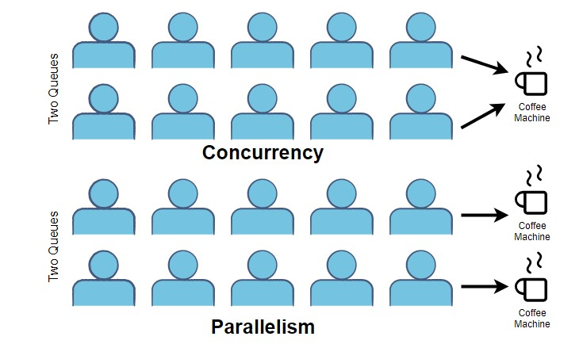

## Goroutines 🚀


### O que são Goroutines? 🤔
Goroutines são funções ou métodos que podem ser executados em paralelo. 
Elas são extremamente leves e são gerenciadas pelo runtime do Go, o que significa que você pode iniciar milhares de goroutines com uma sobrecarga mínima. Isso é possível porque o runtime do Go gerencia a execução das goroutines de maneira eficiente, distribuindo-as entre múltiplos threads do sistema operacional conforme necessário.

A principal vantagem das goroutines é que elas facilitam a criação de programas altamente concorrentes e eficientes. Em vez de criar e gerenciar threads manualmente, você pode simplesmente usar goroutines para executar tarefas em paralelo. Isso torna o código mais simples e fácil de manter, além de melhorar o desempenho do programa em sistemas com múltiplos núcleos de processamento.

### Qual a diferença entre concorrência e paralelismo?

#### Concorrência:  
 – Refere-se à capacidade de fazer progresso em várias tarefas (ou atividades) na mesma linha do tempo.  
 – Em um programa concorrente, várias tarefas podem ser iniciadas e executadas, podendo alternar entre si, sem que necessariamente sejam executadas no mesmo instante.  
 – A concorrência é sobre lidar com múltiplas coisas ao mesmo tempo, estruturando o programa para que ele possa dar andamento a várias tarefas enquanto espera por recursos, I/O, etc.

#### Paralelismo:  
 – Trata-se da execução simultânea efetiva de múltiplas tarefas em diferentes núcleos ou processadores.  
 – Um programa paralelo executa mais de uma tarefa exatamente no mesmo momento, utilizando recursos de hardware (multi-core ou múltiplos processadores).  
 – O paralelismo é uma forma de implementação da concorrência quando se dispõe de hardware que permite a execução simultânea real.

Resumindo, enquanto a concorrência é uma forma de estruturar um programa para que ele possa lidar com várias tarefas (mesmo que essas tarefas não estejam sendo executadas literalmente ao mesmo tempo), o paralelismo se refere à execução dessas tarefas de forma simultânea, quando hardware e ambiente permitem esse comportamento.

### Beleza, agora como que eu uso uma goroutine?
Para iniciar uma goroutine, basta preceder a chamada da função com a palavra-chave `go`.
Exemplo:

  ```go
  package main

  import (
      "fmt"
      "time"
  )

  func main() {
      // Inicia uma goroutine que imprime uma mensagem
      go func() {
          fmt.Println("Olá, Go!")
      }()

      // time.Sleep é usado para garantir que a goroutine execute antes do programa encerrar
      time.Sleep(100 * time.Millisecond)
  }
  ```

Neste exemplo, a função anônima é executada como goroutine. Note que usamos `time.Sleep` para dar tempo à goroutine de ser executada, pois o `main` pode terminar antes dela.

### Usando funções anônimas e variáveis de loop
Quando se usa uma função anônima dentro de um loop para lançar goroutines, é importante lembrar como as variáveis do loop (como o índice) são capturadas.

#### Erro comum ⚠️:

  ```go
  for i := 1; i <= 5; i++ {
      go func() {
          fmt.Println("Goroutine", i)
      }()
  }
  ```

O código acima resultará em todas as goroutines imprimindo o mesmo valor de `i`, que é o valor final do loop (neste caso, 6). Isso ocorre porque a variável `i` é capturada pela função anônima, e todas as goroutines compartilham a mesma referência a `i`.
Execute o código e você terá esse resultado:
```
Goroutine 6
Goroutine 6
Goroutine 6
Goroutine 6
Goroutine 6
```

Isso pode fazer com que todas as goroutines imprimam o mesmo valor de `i` (o valor final).

Como você resolveria esse problema? 🤔

**Solução:** Passar a variável como parâmetro para a função anônima:

  ```go
  for i := 1; i <= 5; i++ {
      go func(n int) {
          fmt.Println("Goroutine", n)
      }(i)
  }
  ```

Assim cada goroutine recebe seu próprio valor.

### Exemplo de goroutine com loop e time.Sleep ⏲️
- Você pode usar várias goroutines para executar tarefas em paralelo, mas lembre-se de garantir (por `time.Sleep` ou sincronização) que o programa aguarde a execução das goroutines.
- **Atenção:** Usar o `time.Sleep` não é o indicado, o ideal seria utilizar `channels`, `wait groups` ou `mutex` (dependendo do contexto). Entraremos nesses tópicos mais pra frente.
- Exemplo:

  ```go
  package main

  import (
      "fmt"
      "time"
  )

  func main() {
      for i := 1; i <= 5; i++ {
          go func(n int) {
              fmt.Printf("Executando goroutine %d\n", n)
          }(i)
      }
      // Pausa para permitir que as goroutines sejam executadas
      time.Sleep(200 * time.Millisecond)
  }
  ```

## Exercícios 📝

Eu normalmente preciso de prática pra entender algo novo, se não eu apenas escaneio com os olhos e esqueço em seguida.

Se você também é assim, faça a lista de exercícios!

Caso encontre problemas, em seguida teremos uma sessão de erros mais comuns, e também a forma como eu solucionei os exercícios.

1. Crie um programa que lance uma goroutine responsável por imprimir a mensagem "Olá, Go!" na tela.

2. Crie um programa que inicie uma goroutine executando uma função anônima.
  Essa função deve imprimir "Executando função anônima na goroutine".

3. Crie um programa que, por meio de um loop, inicie 5 goroutines.
  Cada goroutine deve imprimir uma mensagem identificando seu número (por exemplo, "Goroutine 1", "Goroutine 2", etc.).

4. Crie um programa que defina uma função (por exemplo, chamada `trabalhoDemorado`) que:
   - Imprima "Iniciando trabalho demorado",
   - Faça um `time.Sleep` de 2 segundos para simular uma tarefa pesada,
   - E, em seguida, imprima "Trabalho demorado finalizado".
   - Inicie essa função em uma goroutine e, no `main`, imprima "Lançando trabalho demorado" antes de iniciar a goroutine.
5. Crie um programa que lance duas goroutines:
   - A primeira goroutine deve, em um loop simples (por exemplo, de 1 a 5), imprimir "Número: X" (onde X é o número atual) e fazer um `time.Sleep` curto (por exemplo, 200 milissegundos) entre as iterações.
   - A segunda goroutine deve, também em um loop de 5 iterações, imprimir "Letra: A, B, C, ..." (você pode fazer algo simples ou uma sequência fixa) com um `time.Sleep` curto entre as iterações.
   - No `main`, após iniciar as goroutines, espere tempo suficiente (com `time.Sleep`) para que ambas concluam suas execuções.

## Erros Comuns com Goroutines ⚠️

### Finalizar o programa antes de as goroutines executarem
- Erro: Não utilizar uma forma (como `time.Sleep`) para dar tempo às goroutines concluírem suas tarefas.
- Exemplo: Iniciar uma goroutine que imprime algo, mas logo após o `main` termina sem esperar, fazendo com que a mensagem nunca seja exibida.

### Capturar variáveis de loop de forma incorreta
- Erro: Em loops que iniciam várias goroutines, usar diretamente a variável de iteração (ex.: `i`) dentro da função da goroutine pode fazer com que todas as funções utilizem o mesmo valor final de `i` (devido ao fechamento da variável).
- Exemplo:

  ```go
  for i := 1; i <= 5; i++ {
      go func() {
          fmt.Println("Goroutine", i)
      }()
  }
  ```

  - Nesse caso, pode ocorrer que todas as goroutines imprimam o mesmo valor de `i`, pois a variável é compartilhada.

### Não tratar a passagem de parâmetros na função anônima
- Erro: Caso seja necessário passar um valor para a goroutine, esquecer de passá-lo como argumento da função pode fazer com que a referência seja capturada mesmo após alteração externa.

## Solução dos exercícios
Pra não ter que ficar rodando manualmente cada exercício, eu usei testes e [exemplos testáveis](https://go.dev/blog/examples).
### Exercício 1:
```go
// main.go
func Ex1() {
	go func() {
		fmt.Println("Olá, Go!")
	}()
	time.Sleep(time.Second)
}

// main_test.go
func ExampleEx1() {
	Ex1()
	// output: Olá, Go!
}
```

### Exercício 2:
```go
// main.go
func Ex2() {
	go func() {
		fmt.Println("Executando função anônima na goroutine")
	}()
	time.Sleep(time.Second)
}

// main_test.go
func ExampleEx2() {
	Ex2()
	// output: Executando função anônima na goroutine
}
```

### Exercício 3:
```go
// main.go
func Ex3() {
	for i := range 5 {
		go func(i int) {
			fmt.Println("Goroutine", i)
		}(i)
	}
	time.Sleep(time.Second)
}

// main_test.go
// Tive que fazer esse helper pra conseguir pegar o valor de /dev/stdout 
// (já que a ordem de exibição é aleatória)
func captureOutput(f func()) string {
	orig := os.Stdout
	r, w, _ := os.Pipe()
	os.Stdout = w
	f()
	os.Stdout = orig
	w.Close()
	out, _ := io.ReadAll(r)
	return string(out)
}

func TestEx3(t *testing.T) {
	out := captureOutput(Ex3)
	expectedOutputs := []string{
		"Goroutine 0",
		"Goroutine 1",
		"Goroutine 2",
		"Goroutine 3",
		"Goroutine 4",
	}
	for _, expected := range expectedOutputs {
		if !strings.Contains(out, expected) {
			t.Fatal("Output not generated: ", expected, " got: ", out)
		}
	}
}
```

### Exercício 4:
```go
// main.go
func trabalhoDemorado() {
	fmt.Println("Iniciando trabalho demorado")
	time.Sleep(2 * time.Second)
	fmt.Println("Trabalho demorado finalizado")
}

func Ex4() {
	fmt.Println("Lançando trabalho demorado")
	go trabalhoDemorado()
	time.Sleep(3 * time.Second)
}

// main_test.go
func ExampleEx4() {
	Ex4()
	// output:
	// Lançando trabalho demorado
	// Iniciando trabalho demorado
	// Trabalho demorado finalizado
}
```

### Exercício 5:
```go
// main.go
func Ex5() {
	alphabet := "ABCDEFGHIJKLMNOPQRSTUVWXYZ"
	go func() {
		for i := range 5 {
			fmt.Printf("Número: %d\n", i)
			time.Sleep(200 * time.Millisecond)
		}
	}()
	go func() {
		for i := range 5 {
			fmt.Printf("Letra: %s\n", string(alphabet[i]))
			time.Sleep(200 * time.Millisecond)
		}
	}()
	time.Sleep(5 * time.Second)
}

// main_test.go
func TestEx5(t *testing.T) {
	out := captureOutput(Ex5)
	expectedOutputs := []string{
		"Número: 0",
		"Número: 1",
		"Número: 2",
		"Número: 3",
		"Número: 4",
		"Letra: A",
		"Letra: B",
		"Letra: C",
		"Letra: D",
		"Letra: E",
	}
	for _, expected := range expectedOutputs {
		if !strings.Contains(out, expected) {
			t.Fatal("Output not generated: ", expected, " got: ", out)
		}
	}
}

```

## Próximos passos!
Em seguida iremos abordar Wait Groups! [Clique aqui para a parte 2!](https://fcidade.com/posts/golang-concurrency-waitgroups/)

## Referências:
- [Concorrência e Paralelismo - Fabio Akita](https://www.youtube.com/watch?v=cx1ULv4wYxM)
- [Go TDD - Concorrência](https://quii.gitbook.io/learn-go-with-tests/go-fundamentals/concurrency)
- [Effective Go - Concorrência](https://go.dev/doc/effective_go#concurrency)
- [Go By Example](https://gobyexample.com/)