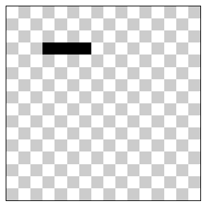
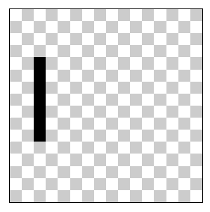
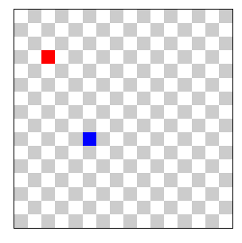
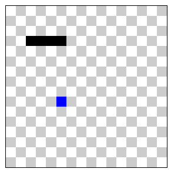
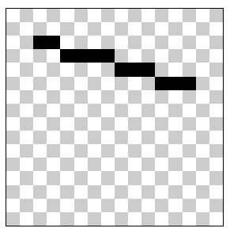
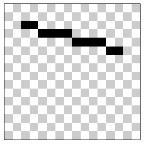
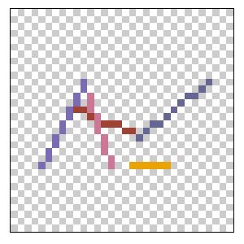

<!-- 
TODO:
- Arrumar descricao
- Escrever o artigo
- Deixar bonitinho
- Criar um artigo separado para os outros métodos e usar esse aqui para focar no algoritimo de Bresenham
- Comentar que é bem famoso com desenvolvedores de rogue like

Refs:
https://www.youtube.com/watch?v=CceepU1vIKo&t=297s&ab_channel=NoBSCode
https://en.wikipedia.org/wiki/Bresenham%27s_line_algorithm
[Bresenham's Line Algorithm - Rogue Like Development](https://web.archive.org/web/20200926144554/http://roguebasin.roguelikedevelopment.org/index.php?title=Bresenham%27s_Line_Algorithm)


<!-- Post -->

<div style="width: 100%;">
    
</div>

## Introdução

No [último post](https://fcidade.com/posts/how-to-draw-a-pixel/) eu expliquei [como desenhar um pixel](https://fcidade.com/posts/how-to-draw-a-pixel/), e desta vez eu pretendo avançar mais um passo e explicar como desenhar uma linha! Caso não tenha visto o artigo anterior, é extremamente recomendado ler para que faça sentido os tópicos discutidos por aqui.

Apesar de parecer uma tarefa simples, ao escrever este artigo eu fui percebendo que seria melhor separar o mesmo em varias partes, com cada parte sendo dedicada a um algorítmo. Assim ficará mais fácil de se aprofundar sem criar uma leitura muito demorada e poluida.
<!-- TODO: Colocar links e citar proximos artigos quando estiverem escritos -->

## Tentativas antes de buscar a solução
Antes de tentar encontrar a melhor forma de gerar uma linha, eu tentei fazer alguns testes por conta própria para ver se eu chegava em uma conclusão válida, já que na minha cabeça, não parecia uma tarefa tão complicada (spoiler: era complicada).

### Desenhando uma linha horizontal

A primeira coisa que pensei em fazer, foi desenhar uma linha horizontal, o que não foi tão trabalhoso.

(A partir de agora estarei utilizando um código que deixei pronto para facilitar minha vida, e vc pode visualiza-lo clicando aqui, porém, recomendo escrever o código da sua propria maneira e não apenas copiar ele pronto.)
<!-- TODO: Adicionar o link pro codigo -->

```js
const drawHorizontalLine = (x0, x1, y) => {
    const xMin = Math.min(x0, x1)
    const xMax = Math.max(x0, x1)
    for (let x = xMin; x <= xMax; x++) {
        c.drawPixel(x, y)
    }
}
```

Basicamente o que essa função faz:
1. Recebe um `x0` e um `x1`, que são as posições onde deve começa e terminar a linha, e um `y`, que define a posição vertical da linha.
2. Ordena da esquerda para a direita, qual é o menor e o maior valor de `x`.
3. Cria um loop com uma variável `x`, que começa com o valor do ponto inicial e é incrementado por `1` até chegar no valor final.
4. Para cada iteração, desenha na tela a cordenada `x` e `y`.

O resultado fica assim:


### Desenhando uma linha vertical
Até aí tudo certo, podemos fazer a mesma coisa (mas dessa vez com o eixo `y`) para criar uma linha vertical:
```js
const drawVerticalLine = (x, y0, y1) => {
    const yMin = Math.min(y0, y1)
    const yMax = Math.max(y0, y1)
    for (let y = yMin; y <= yMax; y++) {
        c.drawPixel(x, y)
    }
}
```
O resultado fica assim:


Simples, né? Porém assim ficamos bem limitados... agora podemos desenhar linhas horizontais e verticais, mas e linhas anguladas? E se eu quiser denhar uma linha que começa em `(2, 3)` e termina em `(5, 9)`? Foi aí que meus experimentos começaram a dar errado e precisei recorrer aos universitários 👿.
<!-- TODO: Colocar link dos videos e explicar -->

### Desenhando uma linha

Eu comecei desenhando os dois pontos iniciais no canvas com cores diferentes, para ficar fácil de visualizar:

```js
const drawLine = (x0, y0, x1, y1) => {
    // p0
    c.color(0xFF, 0x00, 0x00, 0xFF)
    c.drawPixel(x0, y0)

    // pN
    c.color(0x00, 0x00, 0xFF, 0xFF)
    c.drawPixel(x1, y1)
}
```

Em seguida, vou desenhar da mesma forma que fiz para a linha horizontal, e me preocupo com o `y` depois (também vou considerar que x0 sempre será menor que x1).

```js
const drawLine = (x0, y0, x1, y1) => {
    // p0
    c.color(0xFF, 0x00, 0x00, 0xFF)
    c.drawPixel(x0, y0)

    // p1..n-1
    c.color(0x00, 0x00, 0x00, 0xFF)
    for (let x = x0; x <= x1; x++) {
        c.drawPixel(x, y0)
    }

    // pN
    c.color(0x00, 0x00, 0xFF, 0xFF)
    c.drawPixel(x1, y1)
}
```

E agora? Precisamos saber quantos pixels o eixo y deve se mover, e uma forma de fazer isso seria calculando a diferença entre x e y. 
Para isso, podemos usar a fórmula da inclinação (slope) de uma linha, que é dada por:

m = (y1 - y0) / (x1 - x0)
<!-- TODO: Latex -->

Onde (x0, y0) e (x1, y1) são os pontos inicial e final da linha, respectivamente. A inclinação nos diz o quanto y deve mudar para cada mudança em x.

<!-- TODO -->
<!-- Aqui está uma imagem que ilustra a inclinação de uma linha:
 -->

Com base na inclinação, podemos determinar quando incrementar y enquanto desenhamos a linha no canvas.

Agora que já temos o `slope`, podemos calcular x e y:

```js
const drawLineFloat = (x0, y0, x1, y1) => {
    // p0
    c.color(0xFF, 0x00, 0x00, 0xFF)
    c.drawPixel(x0, y0)

    // pN
    c.color(0x00, 0x00, 0xFF, 0x33)
    c.drawPixel(x1, y1)

    // p0 ... p1
    const dx = x1 - x0
    const dy = y1 - y0
    if (dx == 0) {
        return
    }
    const m = (dy / dx)

    c.color(0x00, 0x00, 0x00, 0xFF)
    for (let i = 0; i <= dx; i++) {
        const x = x0 + i
        const y = Math.round(y0 + (i * m))
        c.drawPixel(x, y)
    }
}
```

Uma coisa interessante que notei enquanto testava, é que o vídeo que usei de referencia programava em python, enquanto eu estou usando Javascript.

Com isso, o resultado dele ficava diferente do meu, assim:

E isso aconteceu pq python tem por padrão uma precisão de apenas 6 casas decimais. Caso queira reproduzir esse efeito, basta limitar o número de casas decimais para 6 no `slope`:
```js
const m = (dy / dx).toFixed(6)
```

### Desenhando em todos os octantes

Antes de prosseguir, é importante entender que o plano cartesiano é dividido em 8 octantes. Cada octante representa uma região do plano, e o algoritmo de Bresenham que implementamos até agora só sabe lidar com um octante.

<!-- TODOÇ Adicionar ilustracao dos octantes -->

Para desenhar linhas em todos os octantes, precisamos adaptar o algoritmo para lidar com as diferentes inclinações e direções das linhas. Isso envolve ajustar a forma como incrementamos os valores de x e y, dependendo do octante em que a linha se encontra.

Para isso, é necessario calcularmos o slope não apenas no eixo y, mas tambem no eixo x:


```javascript
const drawLineFloat = (x0, y0, x1, y1) => {
    const dx = x1 - x0
    const dy = y1 - y0
    const step = Math.max(Math.abs(dx), Math.abs(dy))
    const stepX = dx / step
    const stepY = dy / step

    for (let i = 0; i <= step; i++) {
        const x =  Math.round(y0 + (i * stepX))
        const y = Math.round(y0 + (i * stepY))
        c.drawPixel(x, y)
    }
}
```
<!-- TODO: Revisar e melhorar, explicar mais e por mais ilustracoes -->

## Bresenham's Line Algorithm 
O primeiro algorítmo que vamos nos aprofundar será o [Bresenham's Line Algorithm](https://en.wikipedia.org/wiki/Bresenham%27s_line_algorithm), que foi desenvolvido em 1962 por [Jack Elton Bresenham](https://en.wikipedia.org/wiki/Jack_Elton_Bresenham) na IBM, e é utilizado para determinar os pontos que devem ser desenhados em uma linha, em uma array multidimensional.
Um diferencial é que o mesmo foi desenvolvido utilizando apenas números inteiros, já que na época era exigido um alto custo de processamento para lidar com números decimais.

Ao acessar a página do mesmo na Wikipedia, podemos visualizar o algorítmo em pseudo-código:

```lua
plotLine(x0, y0, x1, y1)
    dx = x1 - x0
    dy = y1 - y0
    D = 2*dy - dx
    y = y0

    for x from x0 to x1
        plot(x, y)
        if D > 0
            y = y + 1
            D = D - 2*dx
        end if
        D = D + 2*dy
```

## Passo a passo

Explicar tudo que foi explicado nesse video:
https://www.youtube.com/watch?v=CceepU1vIKo&ab_channel=NoBSCode
OU seguir esse, que vai montando aos poucos
https://www.youtube.com/watch?v=vfPGuUDuwmo&t=59s&ab_channel=mattbatwings

Tentar achar uma forma de melhorar o algoritmo

<div style="display: flex; justify-content: center; align-items: center; flex-direction: column; padding-bottom: 16px ">
    <canvas id="canvas"></canvas>
</div>

<style>
    canvas {
        border: 1px solid black;
        width: 30%;
        image-rendering: pixelated;
    }

    img {
        max-width: 200px;
    }
</style>

<script src='./playground.js'></script>