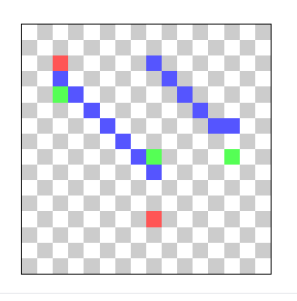
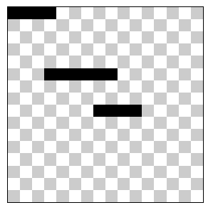

Refs:
https://www.youtube.com/watch?v=CceepU1vIKo&t=297s&ab_channel=NoBSCode


<div style="display: flex; justify-content: center; align-items: center; flex-direction: column; padding-bottom: 16px ">
    <canvas id="canvas"></canvas>
</div>

<style>
    canvas {
        border: 1px solid black;
        width: 30%;
        image-rendering: pixelated;
    }
</style>

<script src='./playground.js'></script>

---

Assets

```js
drawHorizontalLine(x0, y0, x1, y1) {
    if (y0 !== y1) {
        throw new Error(`y0 should equal y1, since its a horizontal line`)
    }
    const minX = Math.min(x0, x1)
    const maxX = Math.max(x0, x1)
    for (let x = minX; x <= maxX; x++) {
        c.drawPoint(x, y0)
    }
},
        ```

Primeira tentativa só com o slope, antes de adaptar com oq tem na wikipedia:

const drawLine = (x0, y0, x1, y1) => {
    // P0
    c.color(0xff, 0x00, 0x00, 0xaa)
    c.drawPoint(x0, y0)

    // In Between
    c.color(0x00, 0x00, 0xff, 0xaa)
    let y = y0
    let slope = (x1 - x0) / (y1 - y0)
    console.log(slope)
    for (let x = x0; x <= x1; x++) {
        y += slope
        c.drawPoint(x, y)
    }

    // P1
    c.color(0x00, 0xff, 0x00, 0xaa)
    c.drawPoint(x1, y1)
}



