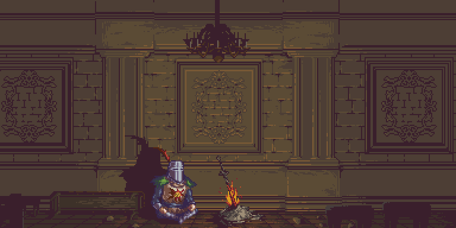

Você já parou para pensar em como a informação de um pixel é armazenada e exibida na tela?
A curiosidade por trás disso sempre esteve na minha mente, e a verdade é que existem várias maneiras de realizar
esse processo,
cada uma com suas especificidades.

Neste post, vamos explorar uma forma simples de estruturar e renderizar pixels em um canvas em *Javascript*, e no
futuro abordar o mesmo em outros contextos, como *OpenGL*, *WebGL*, *DirectX*, *Vulkan*, etc.

**Obs:** Este post é apenas um exercício de aprendizado, não vamos nos preocupar com performance e pode não ser ideal
para ser utilizado em produção.

## O que é um pixel?


Um pixel é a menor unidade de uma imagem em uma tela digital, representando um único ponto em uma grade. Ele define uma cor específica, normalmente através de combinações de vermelho, verde e azul (**RGB**). 

Além dos canais **RGB**, é comum também ser acompanhado por um canal de opacidade, chamado de Alpha (**A**) e costuma ser armazenado em uma estrutura de array unidimencional.

### Como os pixels podem ser organizados com o uso de arrays:
Antes de desenharmos um pixel, precisamos de um lugar para desenhar!

Assim como na vida real, para fazer uma pintura precisamos de uma superficie para ser pintada, na computação gráfica chamamos de canvas.
E nosso canvas nada mais é do que uma estrutura que armazena os dados de cor e opacidade de cada pixel, para em seguida ser exibido em seu monitor.

Existem varias formas de estruturar os dados de um canvas, os mais comuns são Arrays e Matrizes:

### Matriz / Array Bidimensional: 
Utilizando uma matriz, podemos representar o canvas como uma grade de pixels dispostos em linhas e colunas. Cada pixel pode ser facilmente acessado através de suas coordenadas (x, y).

Uma forma de visualizar essa estrutura em código seria a seguinte:
```js
const canvas = [
    // x = 0         x = 1            x = 2 ...
    [r, g, b, a,     r, g, b, a,      r, g, b, a,      ...], // y = 0
    [r, g, b, a,     r, g, b, a,      r, g, b, a,      ...], // y = 1
    [r, g, b, a,     r, g, b, a,      r, g, b, a,      ...], // y = 2 ...
]
```
### Array Unidimensional:

Embora visualmente pensemos em uma imagem como uma grade (bidimensional), os computadores frequentemente armazenam os dados de imagem em um array unidimensional.


Por exemplo, uma imagem de 10x10 pixels seria representada por um array de 100 elementos, onde cada grupo de quatro elementos consecutivos representam as componentes de cor de um pixel (vermelho, verde, azul e alfa).
```js
const canvas = [r, g, b, a,     r, g, b, a,      r, g, b, a,      ...]
```

Utilizaremos a Array Unidimensional, já que ela é mais simples de lidar e também é a estrutura utilizada pelo `canvas` do Javascript.

#### Mas como eu conseguiria saber o `x` e o `y` da minha array unidimensional?

Através do índice, é possivel obter o `x` e o `y` correspondentes aquele pixel:
$$
\{índice} = (y \times \text{largura do canvas} + x) \times 4
$$
Mas de onde vem esse 4?
Simples, como dito anteriormente, utilizamos 4 valores para definir nosso pixel: RGBA, que respectivamente representam as cores *Vermelho*, *Verde* e *Azul*, seguido de um valor de *Opacidade* para aquele pixel.

Caso não precise da opacidade, podemos até diminuir para usar apenas os canais de cores, onde o calculo ficaria assim:
$$
\{índice} = (y \times \text{largura do canvas} + x) \times 3
$$

E caso queira voltar para 1930, ignorando completamente as cores, podemos ter uma estrutura apenas com um canal em cinza, fazendo o calculo ficar ainda mais simples:
$$
\{índice} = (y \times \text{largura do canvas} + x)
$$

> Uma coisa importante de ter em mente é que os pixels normalmente são desenhados de cima para baixo, o que significa que o eixo `y` está invertido. 
> Em outras palavras: A primeira linha de cima da tela teria seu `y` equivalente a `0`, enquanto a ultima linha teria `y` equivalente a altura do canvas.

#### Ainda acho que usar matriz seria mais fácil... quais mais vantagens eu tenho ao utilizar uma array unidimensional?
- **Eficiência de Acesso:** Usar arrays permite um acesso rápido e eficiente aos dados dos pixels. Isso é crucial para o desempenho em operações gráficas, como renderização, edição de imagens e animações.
- **Manipulação Simples:** Arrays facilitam a manipulação dos dados, permitindo que você altere rapidamente a cor de um pixel ou aplique efeitos a uma área específica da imagem.
- **Integração com Algoritmos:** Muitas operações e algoritmos em processamento de imagens (como filtros e transformações) são mais simples e eficientes quando os dados estão organizados em arrays, pois podem iterar facilmente sobre os elementos.
- **Compatibilidade com APIs Gráficas:** Muitas bibliotecas e APIs gráficas, como o Canvas API no JavaScript, utilizam essa estrutura de dados para facilitar a comunicação e manipulação das imagens.

Em resumo, organizar pixels em um array oferece eficiência, simplicidade e compatibilidade com operações de processamento de imagens, tornando-o um método padrão na programação gráfica.

---

## Hora do código

Agora que finalizamos a explicação teórica, podemos demonstrar como utilizar isso com o canvas do Javascript.

Primeiro, precisamos de um elemento de canvas no nosso html:
```html
<canvas id="canvas"></canvas> 
```
Em seguida, acessamos esse canvas pelo Javascript, e pegamos o seu contexto 2D:
```js
const canvas = document.getElementById('canvas');
const ctx = canvas.getContext('2d');
```
O `context` é o que utilizaremos para desenhar no nosso canvas, nesse caso utilizaremos o contexto `2d`, mas também podemos utilizar outros contextos, como o [WebGL](https://get.webgl.org/), que é uma implementação do [OpenGL](https://www.opengl.org/) para a web. ([doc](https://developer.mozilla.org/en-US/docs/Web/API/HTMLCanvasElement/getContext))

Defina o tamanho que achar melhor para o seu canvas, no meu caso, utilizarei 20x20:
```js
canvas.width = 20
canvas.height = 20
```

E para finalizar a configuração inicial, vamos pegar a array unidimensional que atualmente está sendo utilizada no nosso canvas, para que possamos modifica-la:
```js
const imgData = ctx.getImageData(0, 0, canvas.width, canvas.height);
```

Agora que temos nossa array de cores, podemos definir o valor do nosso primeiro pixel:
```js
imgData.data[0] = 255   // r;
imgData.data[1] = 0     // g;
imgData.data[2] = 0     // b;
imgData.data[3] = 255   // a;
```
Os valores de RGBA sempre vão variar entre 0 e 255, se preferir, também pode escrever em hexadecimal! Faremos isso para o nosso segundo pixel:
```js
imgData.data[4] = 0x33  // r;
imgData.data[5] = 0x12  // g;
imgData.data[6] = 0xee  // b;
imgData.data[7] = 0xff  // a;
```
Você deve ter notado que apesar de termos configurado os valores na nossa array, nada mudou no canvas.
Precisamos deixar claro ao canvas em que momento as nossas mudanças estarão prontas para ser exibidas, garantindo que não teremos um resultado incompleto desenhado na tela do nosso canvas, e também permitindo optmizar as chamadas da GPU fazendo apenas uma operação, ao inves de várias operações pequenas.

Para isto, basta chamar o método `putImageData` do context, passando a nossa array de cores e a origem (x, y) onde queremos desenhar no canvas (no caso, queremos desenhar no topo esquerdo da tela, ou seja, `x=0` e `y=0`):
```js
ctx.putImageData(imgData, 0, 0);
```
Com isso, você já deve ser capaz de ver dois pixels desenhados no seu canvas:
<div style="display: flex; justify-content: center; padding-bottom: 16px ">
    
</div>
Caso seu canvas esteja um pouco diferente do meu, borrado e sem as bordas, é por que eu adicionei um estilo css para facilitar a visualização das bordas e remover o filtro de anti-serrilhado:

```css
canvas {
    border: 1px solid black;    /* Adicionando uma borda preta e fina para conseguir enxergar melhor o tamanho do canvas */
    min-width: 50%;             /* Colocando um tamanho minimo para conseguir enxergar meu canvas de 20x20, ajuste como quiser. */
    image-rendering: pixelated; /* Removendo o filtro de anti-serrilhado. Costuma ser bem útil em imagens grandes, mas para pixel art e canvas muito pequenos acaba borrando a imagem. */
}
```
Pronto! Agora seu canvas deve estar igual ao meu.

### Removendo o trabalho repetitivo

Agora que conseguimos desenhar 2 pixels na tela, definitivamente não queremos ter que desenhar todos os outros manualmente, calculando em qual indice vai cada canal.
Então vamos aproveitar a fórmula que aprendemos lá encima e criar uma função que nos permita criar pixels a vontade, passando apenas a sua coordenada, e canais de cor.
Caso não lembre da fórmula, é esta aqui:
$$
\{índice} = (y \times \text{largura do canvas} + x) \times 4
$$
(Lembre-se de trocar o 4 por outro valor, caso tenha utilizando menos ou mais canais)

Nossa função deve receber uma referência a array de cores do canvas, sua posição (x, y) e seus canais de cores RGBA:
```js
const putPixel = (imgData, x, y, r, g, b, a) => {
    // Índice calculado utilizando a formula acima
    const index = (x + y * imgData.width) * 4; 
    // Cada canal jã utiliza o índice para posicionar
    // corretamente na array onde o valor deve ser inserido
    imgData.data[index + 0] = r;               
    imgData.data[index + 1] = g;               
    imgData.data[index + 2] = b;               
    imgData.data[index + 3] = a;               
}

```
Com isto, baixa apenas chamar a função algumas vezes:

```js
putPixel(imgData, 5, 5,  0xFF, 0x30, 0xAA, 0xFF)
putPixel(imgData, 15, 3, 0xAF, 0xD0, 0x3A, 0xFF)
putPixel(imgData, 2, 4,  0xFA, 0x3D, 0xA3, 0xFF)
putPixel(imgData, 5, 7,  0x3A, 0x3D, 0xA3, 0xFF)
putPixel(imgData, 3, 5,  0xFA, 0x7D, 0xAA, 0xFF)
```
E já teremos um resultado:
<div style="display: flex; justify-content: center; padding-bottom: 16px ">
    
</div>

Com isto encerramos este post sobre como desenhar um pixel, mas não vá ainda! Abaixo deixarei uma lista de exercícios e soluções!
Futuramente, pretendo abordar também mais tópicos de computação gráfica:
- Desenhando linhas, retangulos, triângulos, circulos e etc do zero!
- Aprendendo a lidar com OpenGL, WebGL, Vulkan, e etc.
- Mais sobre canvas no Javascript!
- E também outros assuntos nada a ver com isso aqui!



### Exercícios:
A solução dos exercícios está logo a baixo, mas tente fazer antes!
<div style="display: flex; justify-content: center; padding-bottom: 16px ">
    
</div>
#### Exercício 1 - Tabuleiro de Xadrez
Tente utilizar a função que criamos para desenhar um tabuleiro de xadrez! (sem as peças)

<div style="display: flex; justify-content: center; padding-bottom: 16px ">
    
</div>
#### Exercício 2 - Cores aleatórias
Tente randomizar as cores que aparecem no seu canvas!

<div style="display: flex; justify-content: center; align-items: center; flex-direction: column; padding-bottom: 16px ">
    <canvas id="canvas"></canvas>
    <button id="resetBtn">Reiniciar</button>
</div>

<style>
    canvas {
        border: 1px solid black;
        width: 30%;
        image-rendering: pixelated;
    }
</style>

<script>
    const canvas = document.getElementById('canvas');
    const resetBtn = document.getElementById('resetBtn');
    const ctx = canvas.getContext('2d');
    canvas.width = 32
    canvas.height = 32

    const putPixel = (imgData, x, y, r, g, b, a) => {
        const index = (x + y * imgData.width) * 4;
        imgData.data[index + 0] = r;
        imgData.data[index + 1] = g;
        imgData.data[index + 2] = b;
        imgData.data[index + 3] = a;
    }
    
    function getMouesPosition(e) {
        const mouseX = e.offsetX * canvas.width / canvas.clientWidth | 0;
        const mouseY = e.offsetY * canvas.height / canvas.clientHeight | 0;
        return {x: mouseX, y: mouseY};
    }

    const clear = (imgData) => {
        for (let x = 0; x < canvas.width; x++) {
            for (let y = 0; y < canvas.height; y++) {
                putPixel(imgData, x, y, 0xFF, 0xFF, 0xFF, 0xFF);
            }
        }
    }

    canvas.addEventListener("mousemove", (e) => {
        const {x, y} = getMouesPosition(e);
        const imgData = ctx.getImageData(0, 0, canvas.width, canvas.height);
        putPixel(imgData, x, y, Math.random() * 255, Math.random() * 255, Math.random() * 255, 255)
        ctx.putImageData(imgData, 0, 0);
    })

    resetBtn.addEventListener("click", (e) => {
        const {x, y} = getMouesPosition(e);
        const imgData = ctx.getImageData(0, 0, canvas.width, canvas.height);
        clear(imgData)
        ctx.putImageData(imgData, 0, 0);
    })

</script>

#### Exercício 3 - Canvas interativo! 
Tente criar uma interação com seu canvas!


---

### Solução dos exercícios:
#### Exercício 1:
```js
canvas.width = 8
canvas.height = 8

const black = [0x00, 0x00, 0x00, 0xFF]
const white = [0xFF, 0xFF, 0xFF, 0xFF]
for (let x = 0; x < canvas.width; x++) {
    for (let y = 0; y < canvas.height; y++) {
        const isWhite = ((x+y) % 2 !== 0);
        const color = isWhite ? white : black;
        putPixel(imgData, x, y, ...color);
    }
}
```
#### Exercício 2:
```js
for (let x = 0; x < canvas.width; x++) {
    for (let y = 0; y < canvas.height; y++) {
        putPixel(imgData, x, y, Math.random() * 255, Math.random() * 255, Math.random() * 255, 255);
    }
}
```
#### Exercício 3:
```js

function getMouesPosition(e) {
    const mouseX = e.offsetX * canvas.width / canvas.clientWidth | 0;
    const mouseY = e.offsetY * canvas.height / canvas.clientHeight | 0;
    return {x: mouseX, y: mouseY};
}

const clear = (imgData) => {
    for (let x = 0; x < canvas.width; x++) {
        for (let y = 0; y < canvas.height; y++) {
            putPixel(imgData, x, y, 0xFF, 0xFF, 0xFF, 0xFF);
        }
    }
}

canvas.addEventListener("mousemove", (e) => {
    const {x, y} = getMouesPosition(e);
    const imgData = ctx.getImageData(0, 0, canvas.width, canvas.height);
    putPixel(imgData, x, y, Math.random() * 255, Math.random() * 255, Math.random() * 255, 255)
    ctx.putImageData(imgData, 0, 0);
})

resetBtn.addEventListener("click", (e) => {
    const {x, y} = getMouesPosition(e);
    const imgData = ctx.getImageData(0, 0, canvas.width, canvas.height);
    clear(imgData)
    ctx.putImageData(imgData, 0, 0);
})

```
